# ERD (Split Views)

## Auth and Player Core

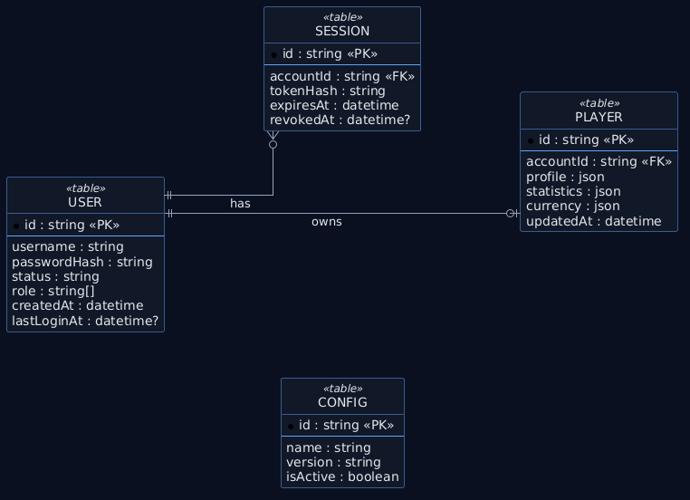

## Character Progression

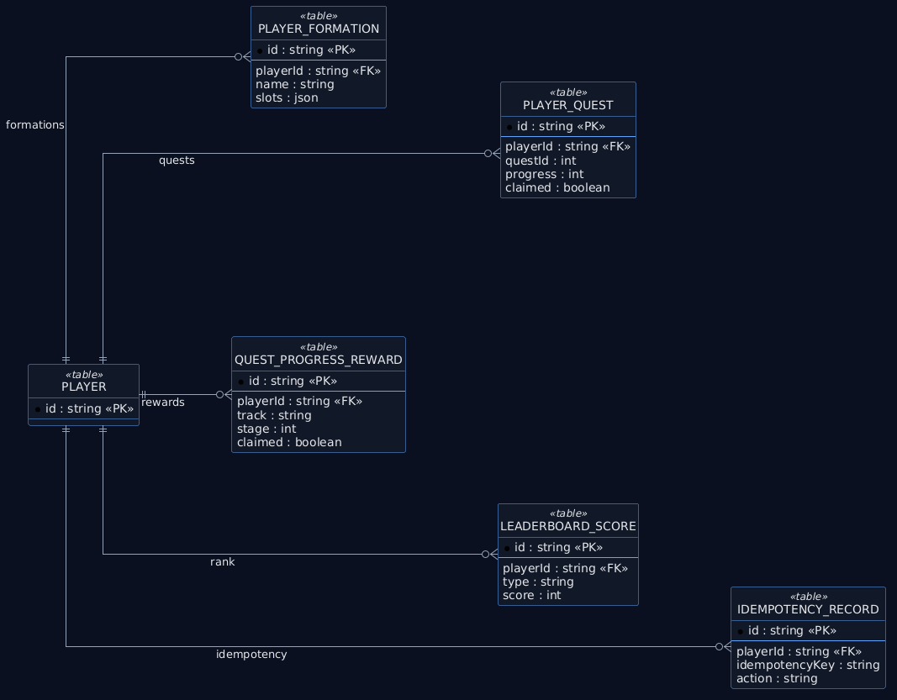

## Inventory and Battle

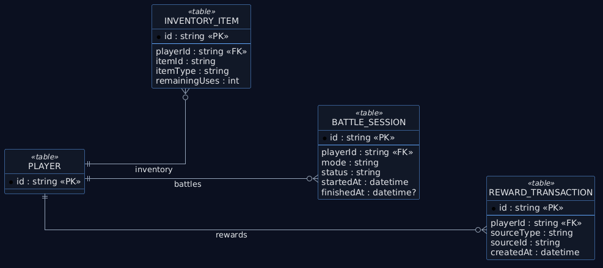

## Character Customization

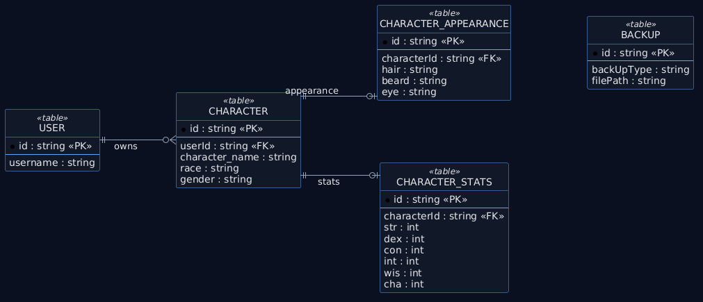

# Deployment

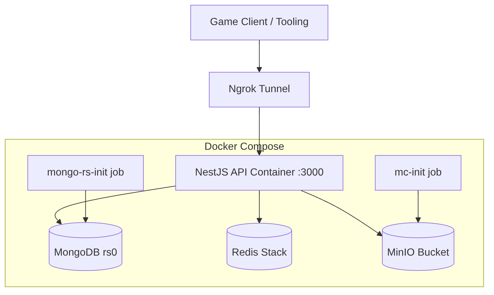

# Use Case

> Note: Use Case diagrams are rendered from PlantUML sources in `./diagrams/usecase-*.puml`.

## Auth

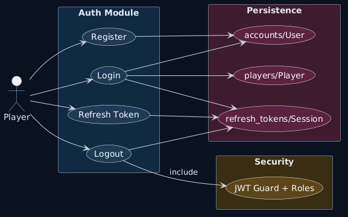

## Player Progression

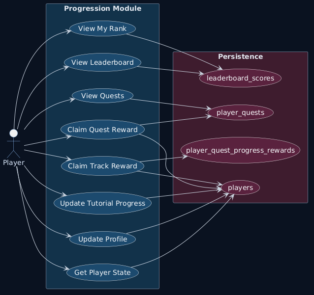

## Character & Formation

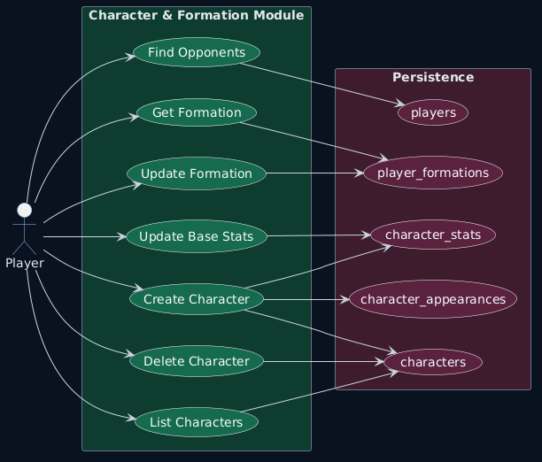

## Inventory, Gacha, Skill Upgrade

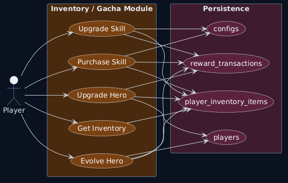

## Combat

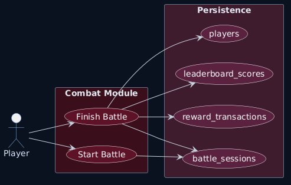

## Admin Config

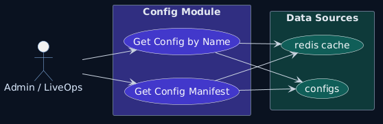

# Sequence

## Auth Login

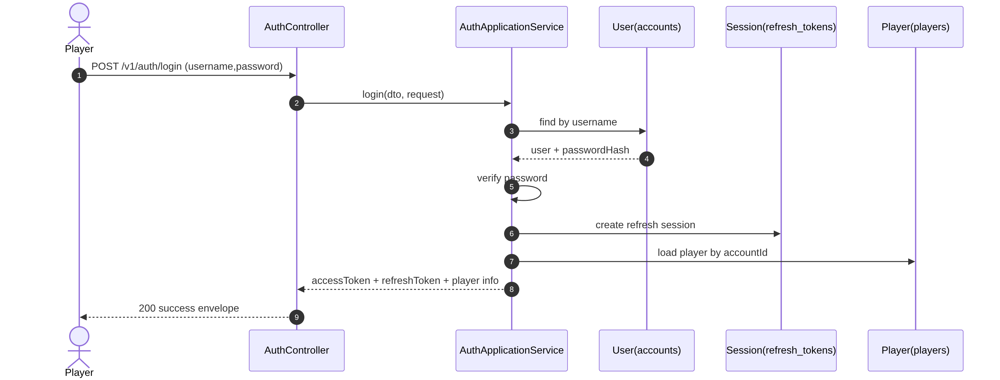

## Auth Refresh

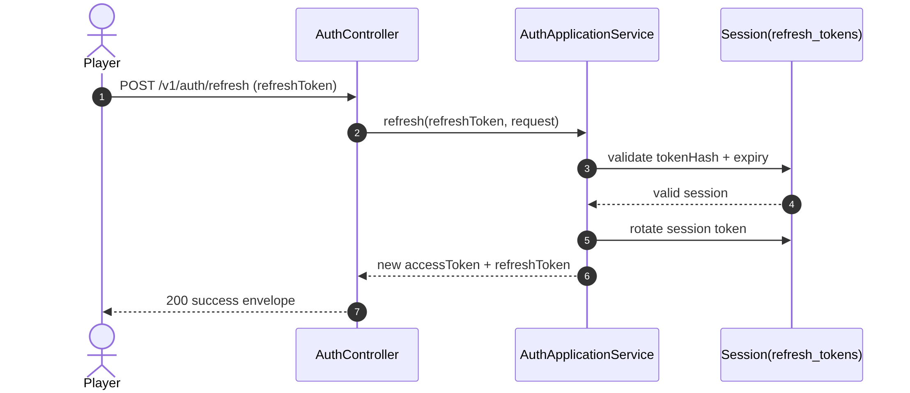

## Character Create

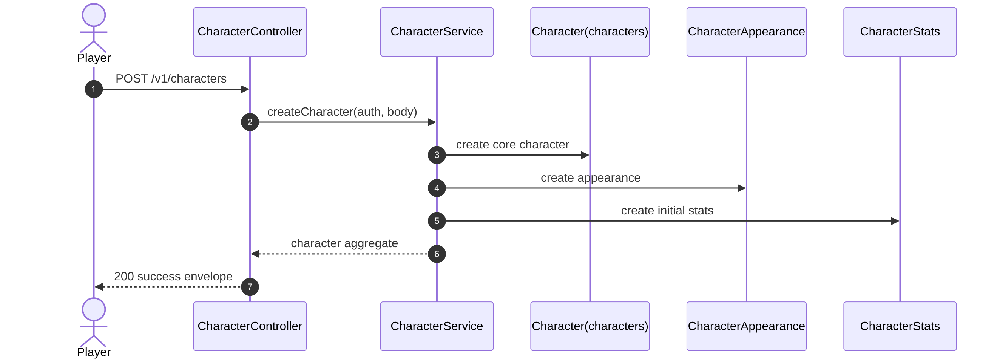

## Quest Claim

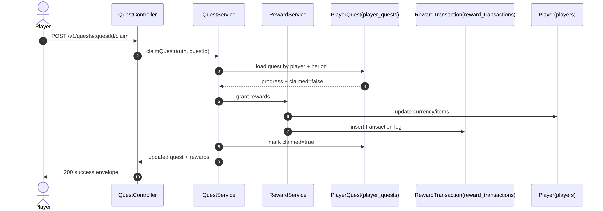

## Battle Start / Finish

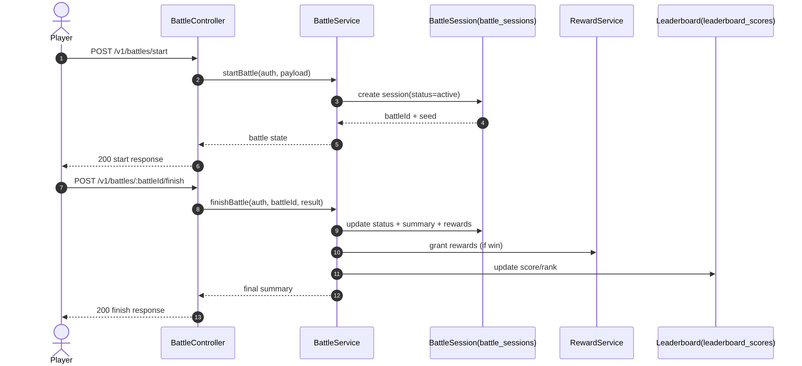

# Activity

## Auth

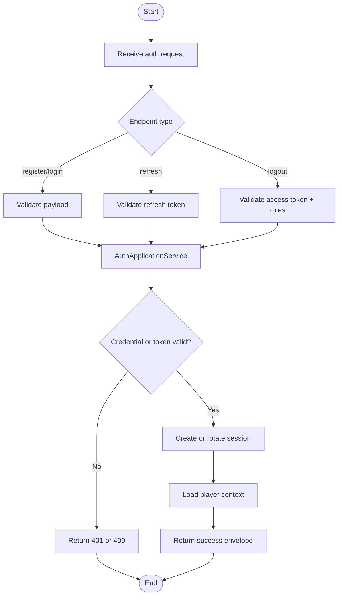

## Character Create

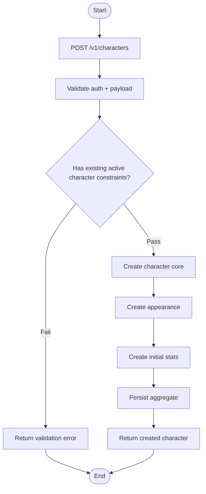

## Quest Claim

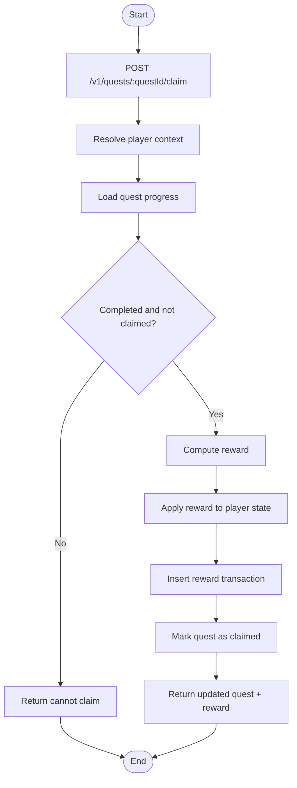

## Battle

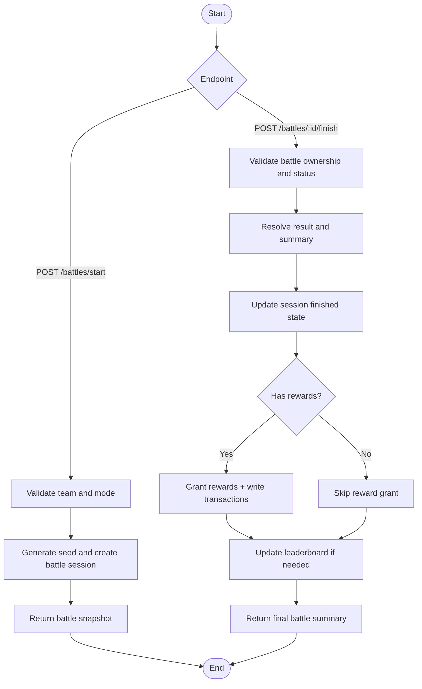

## Inventory

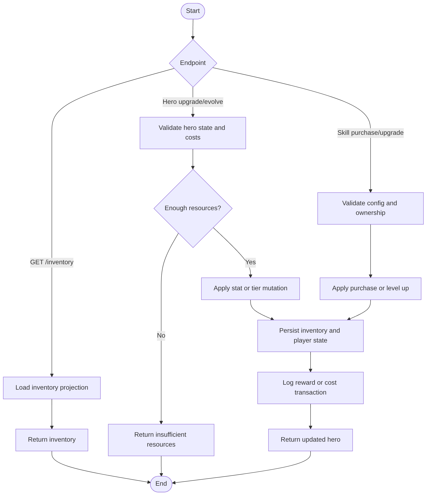
